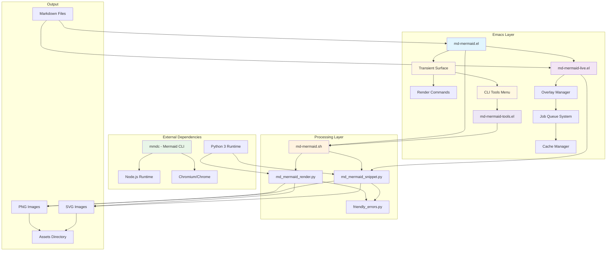
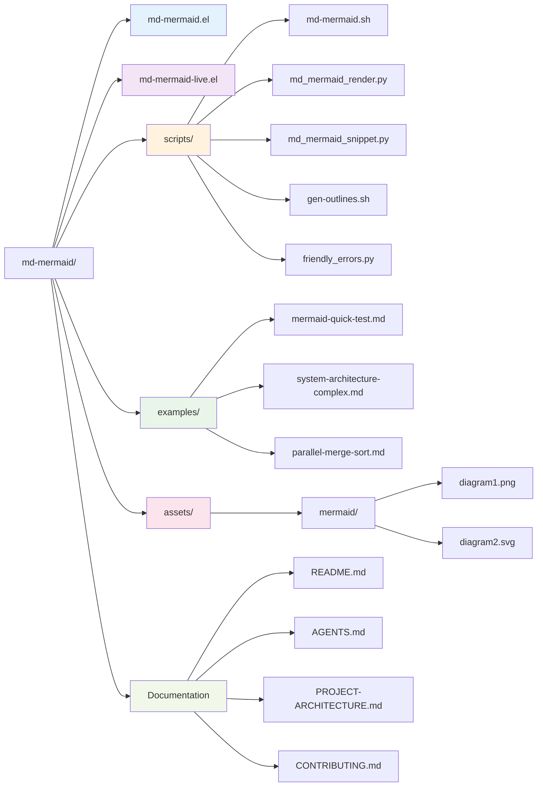
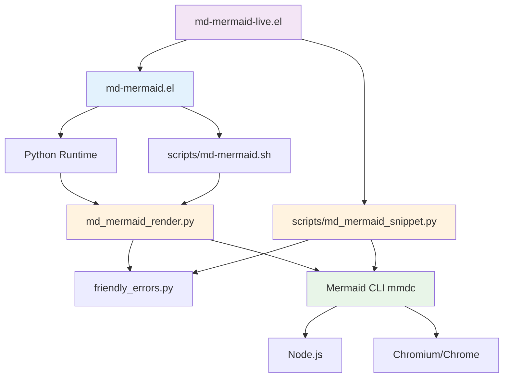
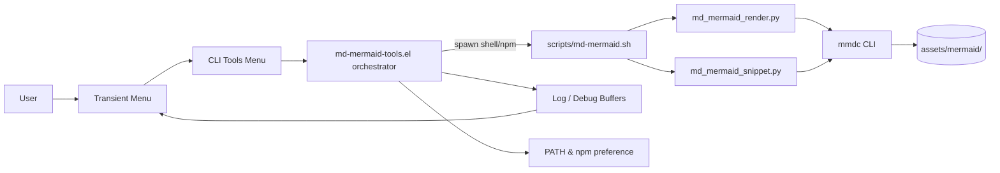
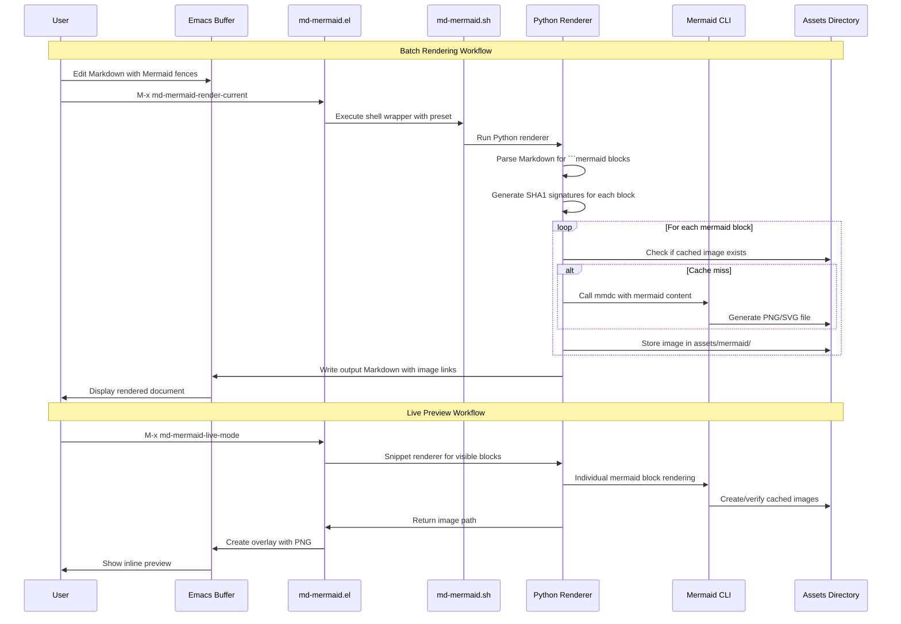
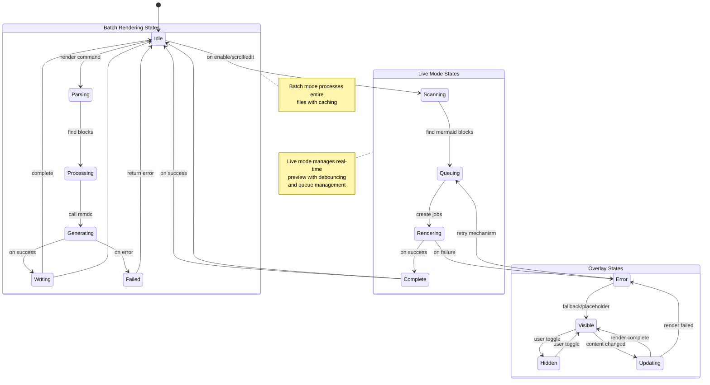
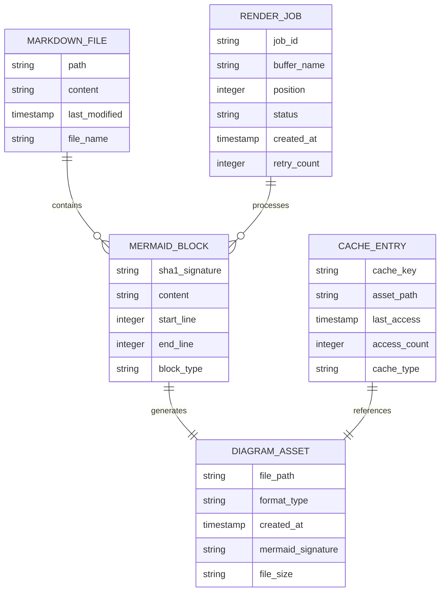

# md-mermaid Project Architecture

## Overview

The **md-mermaid** project is an Emacs package that enables rendering of Mermaid diagrams within Markdown files. It provides both batch rendering capabilities (via command-line tools) and live preview functionality (via inline Emacs overlays). The system transforms Markdown files containing Mermaid code fences into visual diagrams while preserving the original content.

### Technology Stack
- **Primary Language**: Emacs Lisp (for package core and live mode)
- **Backend Processing**: Python 3 (for rendering scripts)
- **Diagram Generation**: Node.js with Mermaid CLI (mmdc)
- **Browser Engine**: Chromium/Chrome (via Puppeteer for PNG rendering)
- **Output Formats**: PNG (for Emacs inline display), SVG (for browser viewing)

### Key Components
- **Core Package** (`md-mermaid.el`): Main rendering interface and batch processing
- **Live Extension** (`md-mermaid-live.el`): Real-time overlay preview system
- **Python Renderers**: Batch processor and snippet renderer
- **Shell Wrapper**: Command-line interface with preset configurations
- **Asset Management**: Caching system for generated diagrams
- **CLI Tools Manager** (`md-mermaid-tools.el` + transient menus): Installs/upgrades Mermaid CLI + helper binaries, probes npm managers, and exposes one-click actions from the Emacs UI

### Current State
The project is in a mature state with functional batch rendering and live preview capabilities. The live mode has known performance limitations with large diagrams but works well for typical use cases (1-4 small to medium diagrams).

## Component Architecture

**Component Responsibilities:**

- **md-mermaid.el**: Core package providing batch rendering commands, configuration management, and user interface
- **md-mermaid-live.el**: Extension for real-time preview with overlay management, job queuing, and caching
- **Transient Surface & Key Customization**: `md-mermaid.el` embeds a top-level transient menu with live state indicators and customizable keybindings (`md-mermaid--transient-menu-keybinding`, `md-mermaid-keymap-prefix`)
- **md-mermaid-tools.el + CLI Tools Menu**: Provides install/update/check commands, npm preference cycling, PATH fixes, log viewers, and debug toggles that run asynchronous shell processes
- **md-mermaid.sh**: Shell wrapper providing preset configurations and command-line interface
- **md_mermaid_render.py**: Batch processor handling full Markdown file parsing and rendering
- **md_mermaid_snippet.py**: Snippet renderer for individual diagram processing
- **mmdc**: Mermaid CLI tool for actual diagram generation

## Directory Structure

**Directory Functions:**

- **Root Directory**: Core Emacs Lisp packages and configuration files
- **scripts/**: All processing scripts (Python renderers, shell wrapper, utilities)
- **examples/**: Test Markdown files for validation and demonstration
- **assets/mermaid/**: Generated diagram cache (PNG and SVG files)
- **Documentation**: README (user guide), AGENTS (validation rules), PROJECT-ARCHITECTURE (this doc), CONTRIBUTING (workflow)

## Module Dependencies

**Dependency Flow:**

1. **Core Loop**: md-mermaid.el → shell script → Python renderer → Mermaid CLI
2. **Live Extension**: md-mermaid-live.el → md-mermaid.el (shared utilities) → snippet renderer
3. **External Dependencies**: All renderers depend on Node.js, Mermaid CLI, and browser engine

## CLI Tools Installation & Diagnostics Flow

**How it behaves**

- The top-level transient menu exposes live-status labels (e.g., “Live Mode [ON/OFF]”) and delegates the CLI submenu to `md-mermaid-tools.el`. Users can also rebind both the transient prefix and the CLI menu key from Emacs without touching init files.
- Each CLI action (install, update, version check, PATH repair, npm preference) uses `md-mermaid-cli--run-async-command` helpers to spawn platform-aware commands, stream output into dedicated log buffers, and surface completion notifications back in the transient UI.
- CLI diagnostics feed directly into the same render pipeline as batch/live commands: installers call `scripts/md-mermaid.sh`, which orchestrates the Python renderers and ultimately the Mermaid CLI (`mmdc` + Chromium/Puppeteer). This keeps the installation lifecycle, render jobs, and troubleshooting flows in a single mental model.
4. **Error Handling**: All Python renderers use friendly_errors.py for error classification

## Data Flow

## State Diagram

**State Transitions:**

- **Idle**: Default state, system ready for commands
- **Scanning**: Detection of Mermaid blocks in visible range
- **Queuing**: Job creation and queue management
- **Rendering**: Active diagram generation
- **Complete/Idle**: Successful completion, return to idle
- **Error**: Failure handling with retry or fallback

## Entity Relationships

**Entity Relationships:**

- **Markdown Files** contain multiple **Mermaid Blocks**
- Each **Mermaid Block** generates one **Diagram Asset**
- **Render Jobs** process specific **Mermaid Blocks**
- **Cache Entries** reference **Diagram Assets** for performance

## Integration Points

### Emacs Integration
- **Package Load**: Standard Emacs package loading and configuration
- **Key Bindings**: Built-in keybindings with override support
- **Mode Integration**: Works with `markdown-mode`
- **Buffer Management**: Handles both file buffers and transient chat buffers

### External Tool Integration
- **Node.js**: Required runtime for Mermaid CLI
- **Mermaid CLI**: Core diagram generation engine
- **Python 3**: Script execution environment
- **Chromium/Chrome**: Required for PNG rendering via Puppeteer

### File System Integration
- **Asset Directory**: Managed caching under `assets/mermaid/`
- **Project Root Detection**: Sophisticated project boundary detection
- **Output Generation**: Sibling file generation with appropriate naming

## Performance Considerations

### Current Limitations
- **Large Diagrams**: Performance degradation with diagrams exceeding viewport height
- **Multi-diagram Files**: Rendering delays with 6+ diagrams due to sequential processing
- **Memory Usage**: Overlay management impacts Emacs performance in very large buffers

### Optimization Strategies
- **Caching**: SHA1-based asset caching prevents unnecessary re-rendering
- **Throttling**: Debounced refresh reduces processing frequency
- **Queue Management**: Bounded concurrent job processing (currently limited to 1)
- **Visibility Scoping**: Only renders visible content for better performance

## Security Considerations

### External Command Execution
- **Input Validation**: Proper escaping of shell arguments and mermaid content
- **Path Sanitization**: Secure handling of input/output file paths
- **Process Isolation**: Separate processes for rendering tasks

### Data Handling
- **Temporary Files**: Secure temporary file creation and cleanup
- **Content Injection**: Protection against malicious mermaid diagram content
- **Resource Limits**: Configurable limits for buffer size and diagram count

## TODO Comments

<!-- TODO: Add detailed performance metrics section with benchmark results -->
<!-- TODO: Document configuration options and their default values -->
<!-- TODO: Include troubleshooting guide for common issues -->
<!-- TODO: Add developer setup instructions and contribution guidelines -->
<!-- TODO: Document API surface for custom extensions -->
<!-- TODO: Include changelog and version history -->
<!-- TODO: Add security considerations for enterprise deployments -->
<!-- TODO: Document integration with other Emacs packages -->

## Summary

The md-mermaid project represents a well-architected Emacs package that successfully bridges Markdown editing with diagram visualization. Its separation of concerns between batch processing (md-mermaid.el) and live preview (md-mermaid-live.el) provides both reliability and interactivity. The modular Python rendering system, combined with external Mermaid CLI integration, creates a flexible foundation that can handle various use cases from simple documentation to complex technical diagrams.

The current implementation delivers robust core functionality with known performance characteristics and clearly defined architectural boundaries. Future development opportunities exist in performance optimization, enhanced error handling, and expanded integration capabilities.
