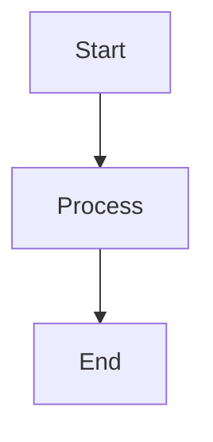

# md-mermaid for Emacs

[](https://www.gnu.org/licenses/gpl-3.0)
[](https://www.gnu.org/software/emacs/)
[](https://nodejs.org/)

md-mermaid renders Mermaid code fences inside Markdown buffers, writes sibling Markdown/PNG/SVG outputs, and provides a live overlay mode so diagrams stay in sync while you edit. Everything happens from Emacs: the transient menu exposes rendering commands, live-mode toggles, diagnostics, and a full CLI tools installer so you can bootstrap `mmdc`, Puppeteer, and friends without leaving the editor.

## Table of Contents

- [Highlights](#highlights)
- [Rendering & Live Preview at a Glance](#rendering--live-preview-at-a-glance)
- [Installation](#installation)
  - [Requirements](#requirements)
  - [Install the Elisp package](#install-the-elisp-package)
  - [Keybindings](#keybindings)
  - [Install CLI dependencies from Emacs (recommended)](#install-cli-dependencies-from-emacs-recommended)
  - [Command-line usage (non-Emacs batch mode)](#command-line-usage-non-emacs-batch-mode)
- [Everyday Workflow](#everyday-workflow)
  - [Batch rendering](#batch-rendering)
  - [Live overlays](#live-overlays)
  - [CLI management](#cli-management)
- [Configuration Snippets](#configuration-snippets)
- [Examples & Screenshots](#examples--screenshots)
- [Documentation & References](#documentation--references)
- [Troubleshooting](#troubleshooting)
- [Credits](#credits)
- [Contributing](#contributing)
- [License](#license)

## Highlights
- **One command, multiple outputs** – `md-mermaid-render-current` produces `-images.md` (SVG) or `-emacs.md` (PNG) with pre-linked assets under `assets/mermaid/`.
- **Live overlays** – `md-mermaid-live-mode` renders visible fences asynchronously, keeps existing diagrams onscreen, and respects scroll/visibility toggles.
- **Integrated CLI installer** – the CLI Tools menu installs/updates/checks Mermaid CLI, Puppeteer, Chromium, etc., using async processes and optional notifications.
- **Customizable surface** – keybindings for the transient menu and the `C-c M` prefix can be re-bound interactively via the menu option or `M-x md-mermaid-customize-keys`, and saved for future sessions.
- **Python + Node toolchain included** – shell wrapper and render/snippet Python scripts ship with the package; no external Makefile dance required.

## Rendering & Live Preview at a Glance

**Transient Menu** (`M-x md-mermaid-transient`):

| Key | Action |
|-----|--------|
| `r` | Batch render current buffer (choose PNG/SVG preset) |
| `l` | Toggle live overlays (stateful ON/OFF indicator) |
| `t` | Open CLI Tools menu (install/update/check mmdc & dependencies) |
| `v` | Toggle code visibility |
| `s` | Toggle scroll stabilizers |
| `c` | Toggle code/diagram display |
| `a` | Toggle all visibility options |
| `e` | Show diagnostics |
| `x` | Clear overlays |
| `R` | Restart live mode |
| `g` | Render visible region |

**How it works:**
- Batch mode parses the entire Markdown buffer and writes sibling Markdown with image references.
- Live mode watches edits/scroll events, queues renders per fence, and reuses cached PNGs until fresh output arrives.
- CLI Tools menu drives `md-mermaid-tools.el`, which spawns npm/system commands, logs output, and surfaces results via notifications or log buffers.

## Installation

### Requirements
- Emacs 29.1+ (native compilation welcome but not required)
- Python 3.7+ (already bundled on most distros)
- Node.js 18.0.0+ (required by Mermaid CLI)
- Mermaid CLI runtime (`mmdc`) and Chromium/Puppeteer (auto-installed via the CLI menu, or install manually with npm/system packages)

### Install the Elisp package

**straight.el**
```elisp
(use-package md-mermaid
  :straight (:host github :repo "ahmetus/md-mermaid")
  :commands (md-mermaid-render-current
             md-mermaid-preview-last-svg
             md-mermaid-transient))
```

**Emacs 30+ `use-package :vc`**
```elisp
(use-package md-mermaid
  :vc (:url "https://github.com/ahmetus/md-mermaid" :rev :newest)
  :commands (md-mermaid-render-current md-mermaid-transient))
```

**Manual clone**
```bash
cd ~/.emacs.d && git clone https://github.com/ahmetus/md-mermaid.git
```
```elisp
(add-to-list 'load-path (expand-file-name "md-mermaid" user-emacs-directory))
(require 'md-mermaid)
```

### Keybindings

This package does not set global keybindings by default. To enable the recommended bindings, add the following to your init.el:

```elisp
(global-set-key (kbd "C-c m") 'md-mermaid-transient)
(global-set-key (kbd "C-c M") 'md-mermaid-prefix)
```

Or customize `md-mermaid-transient-menu-keybinding` and `md-mermaid-keymap-prefix`.

**Note:** You can also bind these keys interactively via the menu option (`M-x md-mermaid-customize-keys`) which allows you to save them to your custom file.

### Install CLI dependencies from Emacs (recommended)
1. `M-x md-mermaid-transient`
2. Press `t` to open the CLI Tools menu
3. `I` installs every required tool; `i`, `u`, `v`, `d`, etc. operate on individual tools

The installer picks the preferred npm client (`npm`, `pnpm`, `yarn`, `bun`), fixes PATHs when needed, streams output to dedicated buffers, and can notify through Emacs and/or the OS.

Manual npm/system installation still works: install Node.js, then `npm i -g @mermaid-js/mermaid-cli puppeteer`, plus Chromium/Chrome if your OS doesn’t bundle it.

### Command-line usage (non-Emacs batch mode)

The shell wrapper lets you render Markdown files directly:

```bash
# PNG preset (1400px wide) with forced re-render
bash md-mermaid/scripts/md-mermaid.sh \
    -i examples/mermaid-quick-test.md \
    -png1400 -f

# SVG output (ideal for browsers/git hosting)
bash md-mermaid/scripts/md-mermaid.sh \
    -i examples/mermaid-quick-test.md \
    -svg -f
```

Key flags:
- `-i FILE` – input Markdown
- `-o FILE` (optional) – override output Markdown path
- `-d DIR` – assets directory (defaults to `assets/mermaid/`)
- `-svg` / `-png1280` / `-png1400` / `-png1800` / `-pngW WIDTH`
- `-f` – force re-render even if cached assets exist

The command produces the same sibling Markdown + asset layout used by the Emacs commands, so you can mix CLI and editor workflows freely.

#### Windows / PowerShell / WSL notes

- **WSL2 (recommended)**: Install md-mermaid inside your Linux home directory and run either the Emacs commands (from `emacs -nw` or GUI) or the wrapper script exactly as shown above. Node/npm/Chromium installs will live inside WSL and do not need to interact with Windows.
- **PowerShell / Git Bash**: The wrapper is a Bash script. If you prefer native Windows, install Git for Windows (or MSYS2) so you have a `bash` binary, then run:
  ```powershell
  bash md-mermaid/scripts/md-mermaid.sh -i path\to\file.md -png1400
  ```
  Make sure Node.js/npm are on your PATH (install from https://nodejs.org/), and install Mermaid CLI with:
  ```powershell
  npm install -g @mermaid-js/mermaid-cli puppeteer
  ```
  If Puppeteer cannot find Chrome, install Microsoft Edge/Chrome and set:
  ```powershell
  $env:PUPPETEER_EXECUTABLE_PATH = "C:\Program Files (x86)\Microsoft\Edge\Application\msedge.exe"
  ```
- **Path handling**: Use absolute paths or quote Windows-style paths (`"C:\Users\you\Documents\file.md"`) when calling the wrapper.
- **Output sharing**: Assets generated via PowerShell/Git Bash will still land under `assets\mermaid\...`; Emacs on Windows can open the resulting `*-emacs.md` / `*-images.md` files without issue.

## Everyday Workflow

### Batch rendering
```elisp
;; Render the current Markdown buffer and open the SVG/PNG output
(M-x md-mermaid-render-current)   ; or C-c m r if global bindings are enabled
```
- Prompts for preset (SVG, PNG 1280/1400/1800, custom width)
- Writes sibling Markdown (`foo-images.md` or `foo-emacs.md`) and assets under `assets/mermaid/`
- `M-x md-mermaid-preview-last-svg` opens the most recent SVG output in your preferred browser/grip/http server

**Example: Input → Output**

Input file (`example.md`):
````markdown
# My Documentation


````

Generated output (`example-images.md` for SVG or `example-emacs.md` for PNG):
````markdown
# My Documentation


````

The diagram is rendered and saved to `assets/mermaid/`, with the markdown file automatically linking to it.

### Live overlays
```elisp
(M-x md-mermaid-live-mode)        ; toggle live rendering in the current buffer
```
- `l` in the transient menu flips the mode and shows ON/OFF inline
- `R` restarts the worker/overlays; `g` renders just the visible window once
- `v`, `s`, `c`, `a` control code visibility and scroll stabilizers for large diagrams

### CLI management
```text
t → open CLI Tools menu
  i/u/v → install, update, check a tool
  I/U/V → operate on all tools
  d → view tool docs, n/N/B → notification toggles, D → debug mode
```
Logs live in `*md-mermaid-cli*` buffers, and notifications fire when long installs finish (configurable).

## Configuration Snippets

```elisp
(setq md-mermaid-open-browser 'grip)          ; svg preview: http / grip / browse-url
(setq md-mermaid-install-global-keybindings t); C-c m … transient, C-c M … prefix map
(setq md-mermaid-default-preset 'png1400)     ; choose default batch preset
(setq md-mermaid-cli-preferred-npm "npm")      ; or "pnpm", "yarn", "bun"
(setq md-mermaid-notify-method 'both)         ; 'emacs, 'os, or 'both
(setq md-mermaid-notify-batch-when 'focus-away)
```

## Examples & Screenshots

- **Quick smoke test** – [`examples/mermaid-quick-test.md`](examples/mermaid-quick-test.md) (paired `*-emacs.md` and assets) shows flowchart + sequence output.
- **Parallel merge sort** – [`examples/parallel-merge-sort.md`](examples/parallel-merge-sort.md) illustrates large multi-step diagrams with matching PNG/SVG exports.
- **System architecture** – [`examples/system-architecture-complex.md`](examples/system-architecture-complex.md) mirrors the design described in `PROJECT-ARCHITECTURE.md`.
- **Conversation overlays** – [`examples/ts-openai-chat-arch.md`](examples/ts-openai-chat-arch.md) highlights multi-buffer live rendering.

Live overlay view inside Emacs:


Batch PNG output (parallel merge sort):


Browser/SVG preview:


All screenshots live under `examples/` so they can double as regression fixtures.

## Documentation & References

- [Project Architecture](PROJECT-ARCHITECTURE.md) – overall data flow, diagrams, and component map.
- [AGENTS](AGENTS.md) – contributor guardrails (validation commands, lint policy, outline regeneration).
- [CONTRIBUTING](CONTRIBUTING.md) – workflow checklist (snapshots, validators, docs, PR expectations).

## Troubleshooting
- **`mmdc` not found** – run the CLI Tools installer (`t` → `I`) or ensure `npm i -g @mermaid-js/mermaid-cli` and `which mmdc` reports a path Emacs can see.
- **Chromium/Puppeteer errors** – install system Chromium (apt/dnf/pacman/brew/winget) or let Puppeteer download its bundled copy; set `PUPPETEER_EXECUTABLE_PATH` if you prefer a system browser.
- **PNG not updating in live mode** – use `l` in the transient menu to toggle off/on (calls the real minor mode), or `R` to restart the worker if you changed large sections.
- **Want different keybindings** – `M-x md-mermaid-customize-keys` rebinds both the transient shortcut and the `C-c M` prefix, with an option to save to your `custom-file`.

## Credits
md-mermaid bundles the Emacs Lisp core (`md-mermaid.el`, `md-mermaid-live.el`), the Python snippet/batch renderers, and the CLI management helpers. It leans on Mermaid CLI (`@mermaid-js/mermaid-cli`), Puppeteer/Chromium, and the broader Emacs community for package tooling. Screenshots/GIFs are coming soon; in the meantime the examples directory contains ready-made Markdown files to exercise the pipeline.

## Contributing

Please read [CONTRIBUTING.md](CONTRIBUTING.md) before opening a PR. The short version: run the validators, regenerate outlines, keep docs in sync, and include screenshots when UI changes.

## License

This project is licensed under the **GNU General Public License v3.0** (GPL-3.0) - see the [LICENSE](LICENSE) file for details.

Users of this software must comply with GPL-3.0 for the md-mermaid code itself. The external dependencies retain their original licenses and are not modified by this project.
