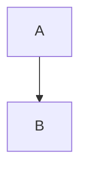
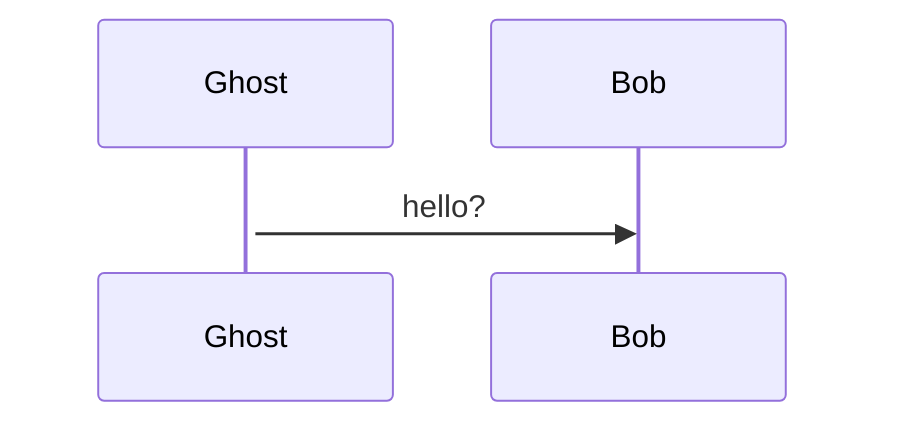
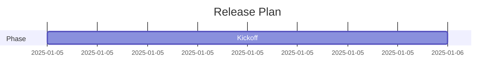
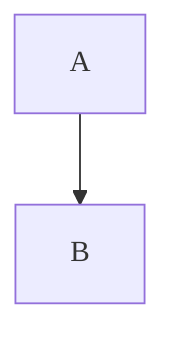
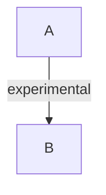

# Mermaid Error Matrix

This file intentionally exercises every friendly-error rule so you can verify JSON
parsing, quick-fix prompts, and messaging end-to-end. Each section documents the
expected tag(s); run `md-mermaid-live-mode` or `md-mermaid-render-current` and
trigger the failure to see how the UI responds. When a diagram is not expected to
render, **do not edit the fence before testing**—otherwise the quick fixes may
“repair” it automatically.

For environment/setup issues (Chromium missing, disk full, etc.), see the final
section with manual reproduction tips.

---

## 1. Unknown Diagram Type (`unknown-type`)

```mermaid
flowchart LR
diagramThis LR
  A --> B
```

No valid header exists, so Mermaid prints *“Unknown diagram type”*.

## 2. Missing Flowchart Direction (`flowchart-dir`)



Direction (`TD`, `LR`, …) is required immediately after `flowchart`.

## 3. Syntax Error / Parse Error (`parse-error`)

```mermaid
flowchart TD
  Start((Start
  Start --> A
```

The opening `((` never closes, yielding an “Unexpected end of input” parse error.

## 4. Lexical Error (`lex-error`)

```mermaid
flowchart TD
  A --> B
  B --> ☠
```

The skull character (`☠`) is not a valid identifier, so Mermaid reports a lexical
error pointing to that line.

## 5. Unexpected Token (`unexpected-token`)

```mermaid
flowchart TD
  A => B
```

`=>` is not a valid arrow inside flowcharts; expect “Unexpected token '=>' …”.

## 6. Unclosed Structure (`unclosed-structure`)

```mermaid
flowchart TD
  subgraph ClusterA
    A --> B
```

Subgraph lacks a matching `end` block.

## 7. Invalid Link Style (`link-style-invalid`)

```mermaid
flowchart TD
  A --> B
  linkStyle 5 stroke-width:5px
```

Only one edge exists, so referencing index `5` triggers “linkStyle … invalid index”.

## 8. Sequence Diagram – Missing Participant (`sequence-actor`)



`Ghost` is never declared; CLI reports that the participant is unknown.

## 9. Sequence Diagram – Syntax Error (`sequence-syntax`)

```mermaid
sequenceDiagram
  Alice ->> Bob missing colon
```

Messages require `: description`. This line triggers “message syntax invalid”.

## 10. Class Diagram Syntax (`class-syntax`)

```mermaid
classDiagram
  class Person {
    + string name
    + greet() {
  }
```

Method definitions cannot embed braces. Expect “classDiagram malformed” or similar.

## 11. ER Diagram Syntax (`er-syntax`)

```mermaid
erDiagram
  USER ?--* ORDER : places
```

`?--*` is not a recognized cardinality symbol.

## 12. State Diagram Syntax (`state-syntax`)

```mermaid
stateDiagram-v2
  [*] --> Idle
  state Active {
    Idle --> Busy
```

Composite state is never closed with `}` / `end`, so the parser raises an error.

## 13. Gantt Date Parse Error (`gantt-date`)



Date uses `/` instead of `-`, resulting in *“Invalid date format”*.

## 14. Pie Diagram Non-numeric Value (`pie-value`)


Pie slices must be numeric; `"forty"` yields *“value must be a number / NaN”*.

## 15. Include Missing File (`include-missing`)


Mermaid tries to fetch the JSON and reports `ENOENT` / “file not found”.

## 16. Invalid Init/Config JSON (`config-json`)


Trailing comma breaks JSON parsing, producing “init JSON invalid”.

## 17. Theme Not Found (`theme-not-found`)


Mermaid CLI prints *“Theme … not found”*.

## 18. Font Missing (`font-missing`)



If the OS lacks this font, Mermaid warns: “Font not found”.

## 19. Version Mismatch / Unknown Directive (`version-mismatch`)



Older Mermaid versions flag unknown directives as “Requires Mermaid version …”.

---

## Environment / Runtime Scenarios

These tags require manipulating the runtime rather than editing diagrams. The
following checklist references the classifier tags so you can trigger them on
demand:

| Tag | How to Reproduce |
| --- | ---------------- |
| `puppeteer-missing` | Temporarily rename your Chromium/Chrome executable or run with `PUPPETEER_EXECUTABLE_PATH=/not/there`. |
| `sandbox-failure` | Run inside a sandboxed container and omit `--no-sandbox` so Puppeteer prints the seccomp error. |
| `timeout` | Export `MMD_RENDER_TIMEOUT=1` (or edit snippet script) and render a huge diagram so `mmdc` times out. |
| `disk-full` | Point `--assets-dir` to a nearly full tmpfs (or use `fallocate` to fill the device) before rendering. |
| `permission` | Set `--assets-dir` to a directory without write access. |
| `file-io` | Simulate I/O errors by mounting a read-only filesystem for `assets/mermaid`. |

Document any additional experiments you run here so future testers can repeat
them quickly.
