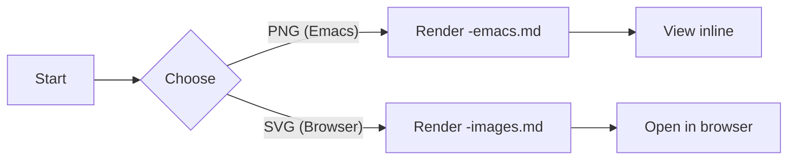
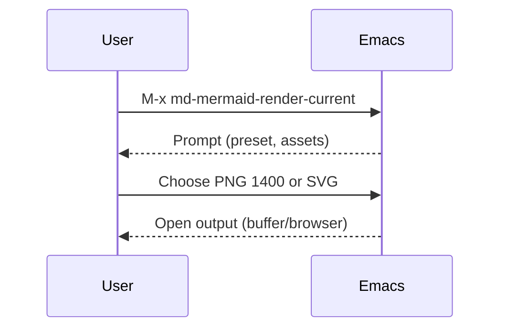

# Mermaid Quick Test

Use this to quickly validate md‑mermaid rendering and preview.

## Flowchart

```mermaid
flowchart LR
  A[Start] --> B{Choose}
  B -- PNG (Emacs) --> C[Render -emacs.md]
  B -- SVG (Browser) --> D[Render -images.md]
  C --> E[View inline]
  D --> F[Open in browser]
```

## Sequence

```mermaid
sequenceDiagram
  participant U as User
  participant E as Emacs
  U->>E: M-x md-mermaid-render-current
  E-->>U: Prompt (preset, assets)
  U->>E: Choose PNG 1400 or SVG
  E-->>U: Open output (buffer/browser)
```

