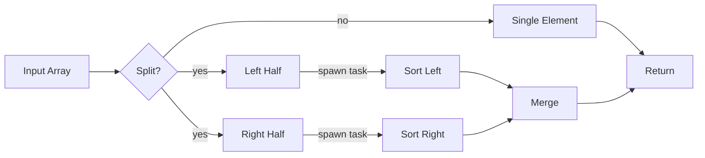
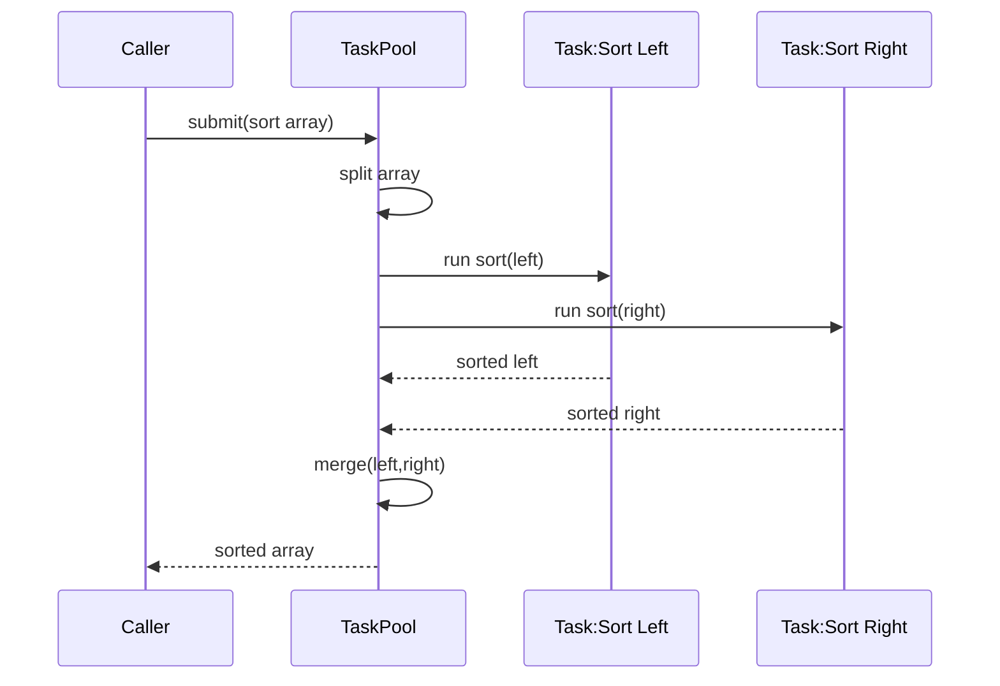

# Parallel Merge Sort – Architecture and Flow

This sample illustrates a parallel merge sort using a task pool. Render with the md-mermaid wrapper to produce images.

## Emacs Usage
- Open this file, then `M-x md-mermaid-render-current` (or `C-c m r`).
- Press RET for the default preset (PNG 1400), RET again for the default assets dir.
- The generated `parallel-merge-sort-emacs.md` opens; enable inline images with `M-x markdown-toggle-inline-images`.
- For browser preview instead, choose “SVG (browser)” at the preset prompt.
  - Reopen later without re-rendering: `M-x md-mermaid-preview-last-svg`.

## CLI Usage
- Emacs inline PNG (recommended for Emacs):
  ```bash
  bash md-mermaid/scripts/md-mermaid.sh -i md-mermaid/examples/parallel-merge-sort.md -png1400 -f
  ```
- Browser SVG (best for 4K/zoom):
  ```bash
  bash md-mermaid/scripts/md-mermaid.sh -i md-mermaid/examples/parallel-merge-sort.md -svg -f
  ```




