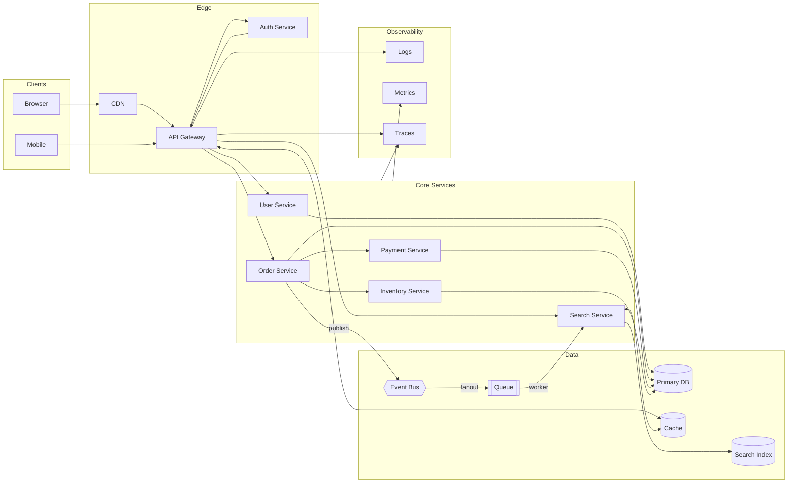
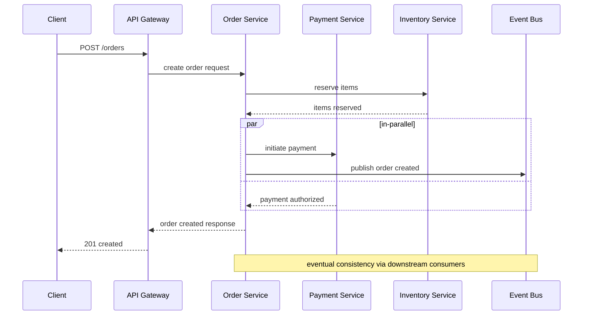
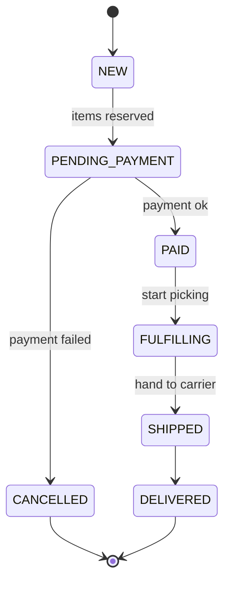
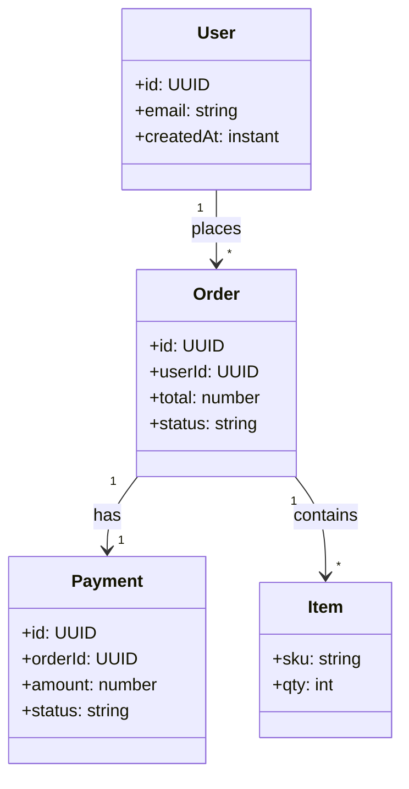

# System Architecture – Complex Demo

This file contains several clean but fairly complex Mermaid diagrams to stress test rendering and preview flows.

## Emacs Usage
- `M-x md-mermaid-render-current` (or `C-c m r`) → RET (PNG 1400) → RET (assets dir)
- Open the generated `system-architecture-complex-emacs.md` and `M-x markdown-toggle-inline-images`.
- For browser SVG preview, choose “SVG (browser)” at the preset prompt.
 - Reopen last SVG view quickly: `M-x md-mermaid-preview-last-svg`.

## 1) Service Topology

## 2) Order Create Flow

## 3) Order State Model

## 4) Domain Model Sketch

---

CLI Usage:
- Emacs inline PNG: `bash md-mermaid/scripts/md-mermaid.sh -i md-mermaid/examples/system-architecture-complex.md -png1400 -f`
- Browser SVG: `bash md-mermaid/scripts/md-mermaid.sh -i md-mermaid/examples/system-architecture-complex.md -svg -f`
