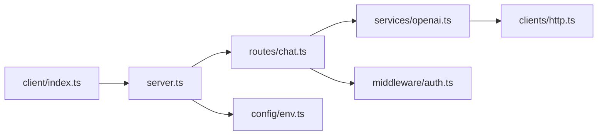
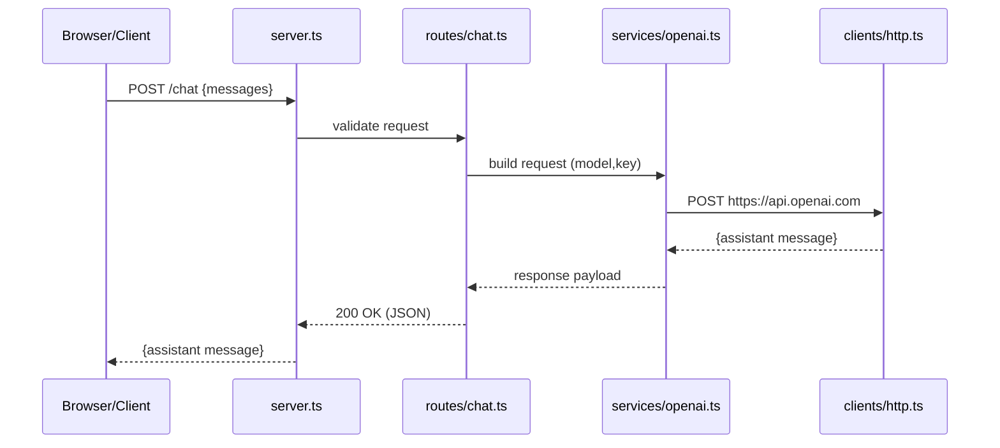

# Pseudo TypeScript OpenAI Chat – Architecture and Flow

This sample shows a minimal project layout and request flow for a chat API using OpenAI.

## Emacs Usage
- Open this file, then run `M-x md-mermaid-render-current` (or `C-c m r`).
- Accept defaults (PNG 1400, project `assets/mermaid`) to create `ts-openai-chat-arch-emacs.md`.
- Toggle inline images with `M-x markdown-toggle-inline-images`.
- Choose “SVG (browser)” to open a browser preview of `ts-openai-chat-arch-images.md`.
  - Reopen later (no re-render): `M-x md-mermaid-preview-last-svg`.

## CLI Usage
- Emacs inline PNG:
  ```bash
  bash md-mermaid/scripts/md-mermaid.sh -i md-mermaid/examples/ts-openai-chat-arch.md -png1400 -f
  ```
- Browser SVG:
  ```bash
  bash md-mermaid/scripts/md-mermaid.sh -i md-mermaid/examples/ts-openai-chat-arch.md -svg -f
  ```

### Project Layout Diagran:


### Request Flow Diagram

